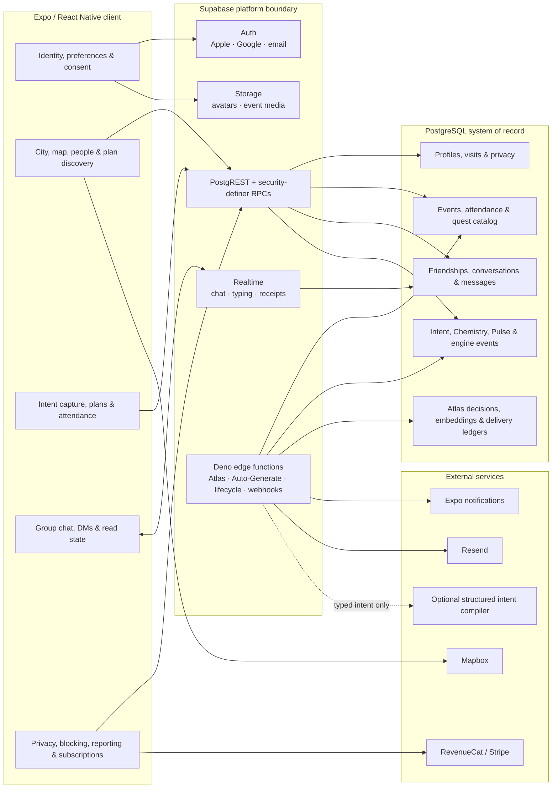
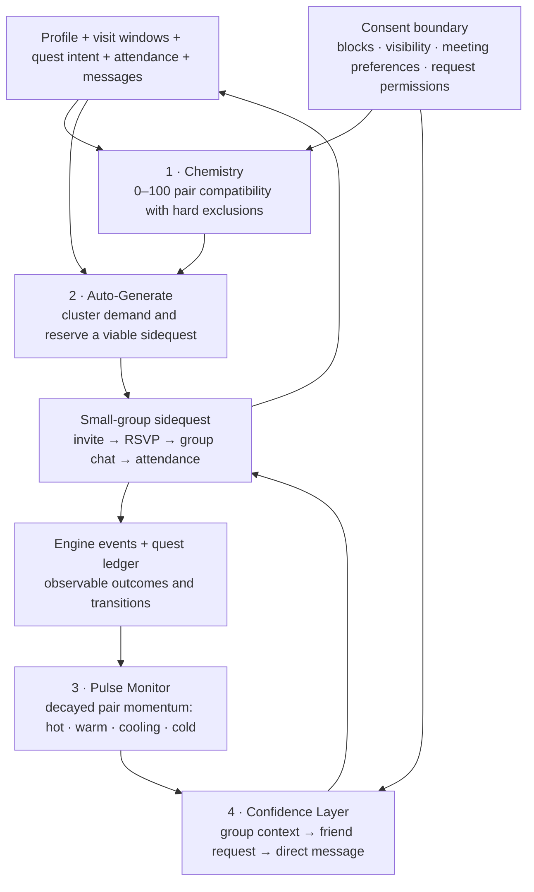

# Waypoint 🧭

> **Meet people through plans, not profiles.**

Waypoint is a full-stack mobile platform for turning shared intent into real-world activity and durable friendship. People log where they are, where they are going, and what they want to do; Waypoint uses those signals to surface compatible people, compose small-group sidequests, coordinate attendance and conversation, and support the relationship after the first meeting.

**Production status:** Waypoint is live at [usewaypoint.app](https://usewaypoint.app). The Atlas section below describes a separately staged planning subsystem; its decision-only execution boundary is not the launch status of the core product.

[](https://usewaypoint.app)
[](https://expo.dev)
[](https://www.typescriptlang.org)
[](https://supabase.com)

## Product thesis

Most social products optimise one isolated moment: profile discovery, event browsing, or messaging. Waypoint treats friendship as a stateful system:

1. understand a person's intent and social constraints;
2. find a compatible activity and group;
3. make attendance and conversation easy;
4. measure whether the connection is strengthening or fading; and
5. reveal more direct forms of connection only when consent and context support them.

The result is a product architecture built around **social momentum**, not engagement for its own sake.

## System architecture



### Architectural boundaries

- **The mobile client is not the trust boundary.** Authorization lives in PostgreSQL row-level security and narrowly granted RPCs.
- **Client identity comes from the authenticated session.** Security-definer functions resolve `auth.uid()` and do not trust caller-supplied ownership fields.
- **Realtime is scoped by membership.** Conversation access, typing state, read receipts, event chat creation, and direct-message creation are enforced server-side.
- **Background systems use durable claims.** Auto-Generate and lifecycle delivery separate transactional state changes from external delivery, with idempotency keys, leases, retry limits, and auditable outcome events.
- **External intelligence is constrained.** Atlas can use a structured model to compile prose, but selection, group composition, scheduling, verification, and the final decision are deterministic.

## The Social Momentum Engine

The Social Momentum Engine connects the full friendship lifecycle. Its four components share a consent-aware signal graph, so each completed sidequest or meaningful interaction improves the next decision without bypassing privacy controls.



### 1. Chemistry

`chemistry_score(a, b)` combines shared interests, geography, overlapping visit windows, meeting preferences, languages, recent intent patterns, and relationship momentum. The function returns a bounded score plus generic reasons, while keeping the private input fields behind a security-definer boundary.

Compatibility never overrides consent. A block in either direction, incomplete onboarding, incompatible meeting preferences, or private visibility produces a hard zero. The function is symmetric and covered by database regression tests.

### 2. Auto-Generate

Auto-Generate converts unmet demand into an executable sidequest:

- the hot path clusters recent compatible intent in a city;
- the cold path detects cities with enough compatible members but too little human-hosted activity;
- a greedy Chemistry-based cluster is matched to a curated quest template;
- `reserve_autogen_event(...)` takes a city-scoped advisory lock, claims a deterministic generation key, rechecks capacity and invite eligibility, and writes the event, tags, provenance, lifecycle claims, and invite outbox in one transaction; and
- members are invited, never auto-RSVP'd.

Delivery occurs after the database transaction. Outbox rows are leased with `FOR UPDATE SKIP LOCKED`, retries use stable provider idempotency keys, and ambiguous deliveries are quarantined rather than duplicated.

### 3. Pulse Monitor

`refresh_pair_pulse()` recomputes relationship momentum nightly from co-completed quests, co-attendance, accepted friendship, direct messages, and shared-group messages. Message contribution is capped per day and the score decays with a 14-day half-life.

Pairs move through `hot`, `warm`, `cooling`, and `cold`. A transition from active momentum to cooling emits an engine event that can support a measured, non-invasive re-engagement nudge. Blocking immediately removes the pair from the model.

### 4. Confidence Layer

The Confidence Layer controls graduated exposure. Shared group context comes first; a server-selected prompt can then suggest a friend request after recent co-attendance or sustained warm momentum; direct messaging remains gated by accepted friendship. Blocks, privacy settings, dismissals, pending requests, declines, and existing relationships are checked before a prompt is returned.

## Atlas planning engine

Atlas turns a free-text intention into a verified and fully audited group-plan proposal. The design deliberately confines probabilistic interpretation to a typed boundary.

```mermaid
flowchart LR
  Intent["Free-text intent"] --> Compile["1 · Compile<br/>strict schema + normalized constraints"]
  Rules["Deterministic fallback"] --> Compile
  Model["Optional structured model"] -.-> Compile
  Compile --> Retrieve["2 · Retrieve<br/>pgvector similarity + hard SQL filters"]
  Retrieve --> Compose["3 · Compose<br/>pairwise Chemistry + average-linkage group growth"]
  Compose --> Schedule["4 · Schedule<br/>intent window + city-local approximation"]
  Schedule --> Verify["5 · Verify<br/>budget · time · risk · exclusions · eligibility · group bounds"]
  Verify --> Decision{"All blocking checks pass?"}
  Decision -- "yes" --> Proposal["Verified proposal"]
  Decision -- "no" --> Reject["Recorded rejection; try next candidate"]
  Proposal --> Ledger["6 · Decision ledger<br/>versions · timings · candidates · reasons"]
  Reject --> Ledger
  Ledger --> Replay["Replay under the current engine<br/>report decision drift"]
```



### AI proposes; code decides

- **Typed compiler:** prose becomes a `CompiledIntent` under a strict JSON schema. Every number, enum, list, and range is normalised again before entering the engine.
- **Deterministic degradation:** a missing credential, refusal, timeout, or malformed response falls back to the rule-based compiler. The chosen path is recorded.
- **Semantic retrieval with scalar guardrails:** pgvector and an HNSW index rank catalog similarity; duration, cost, risk, and social mode remain hard SQL filters.
- **Consent-aware group composition:** the requester seeds a bounded group; every pair is scored through Chemistry; a zero edge disqualifies a candidate; selected and rejected candidates receive ledger reasons.
- **Defense-in-depth verification:** pure checks reassert budget, time, risk, exclusions, confidence, member eligibility, group size, Chemistry floor, future start, intent window, sociable hours, and planning horizon.
- **Decision provenance:** `atlas_decisions` records the raw intent, compiled constraints, candidate attempts, verifier output, proposal, timings, and engine/model/prompt/embedding versions. `npm run atlas:replay` detects drift with no side effects.

Atlas's current execution contract is decision-only: it returns and records a verified proposal but does not create events, invites, or messages. That boundary is enforced by the edge function, not left to client convention.

## Data, security, and concurrency

The schema coordinates identity, location windows, activities, attendance, friendships, real-time messaging, subscriptions, privacy, matching, lifecycle jobs, and decision provenance.

Key controls include:

- row-level security on user and service-owned tables;
- zero-policy, service-only ledgers for Atlas decisions, embeddings, and engine telemetry;
- explicit revocation from `public`, `anon`, and `authenticated` where a capability is service-only;
- authenticated RPCs for friendship transitions instead of direct client DML;
- symmetric block checks across discovery, Chemistry, Pulse, prompts, and messaging;
- transaction-scoped advisory locks and unique idempotency keys for generated events;
- atomic intent capture and one-per-week invitation claims;
- local-only database fixtures—the regression runner refuses non-loopback database URLs; and
- a concurrent `pgbench` scenario that exercises duplicate-generation protection under competing workers.

## Product surfaces

- **17-stage onboarding** captures identity, age eligibility, interests, languages, meeting preferences, travel windows, location, notification choice, and profile media.
- **City and map discovery** combines current location, upcoming visits, plan density, compatible people, search, and Mapbox-backed coordinates.
- **Sidequest creation** supports structured plan details and a catalog-backed intent path.
- **Attendance and event chat** turn an activity into a bounded group context.
- **Friendship and messaging** implement request/accept/decline/cancel flows, event conversations, consent-gated DMs, typing indicators, and read receipts.
- **Safety and privacy** cover visibility, request permissions, blocking, reporting, and account deletion.
- **Commercial infrastructure** supports RevenueCat entitlements, Stripe/RevenueCat webhooks, promo access, and Founder recognition.

## Repository evidence

Every figure below is countable from the repository:

| Evidence | Count | Where to inspect |
| --- | ---: | --- |
| Expo Router modules | 44 | `app/` |
| Onboarding stages | 17 | `modules/onboarding/sequence.ts` |
| PostgreSQL migrations | 83 | `supabase/migrations/` |
| Relational tables represented by the current migration state | 30 | generated schema plus later engine/Atlas migrations |
| Edge functions | 5 | `supabase/functions/` |
| Database regression and concurrency files | 9 | `supabase/tests/` |
| Curated quest templates | 165 | quest catalog seed data |
| Primary maintainer | 1 | Git history |

The repository contains the mobile client, database history, row-level security, server functions, matching logic, lifecycle automation, payment integrations, and regression harness. The product surfaces and their server-side control paths are implemented in the same codebase.

## Repository map

| Path | Responsibility |
| --- | --- |
| `app/` | Expo Router screens and navigation boundaries |
| `components/` | Shared product UI and interaction components |
| `modules/onboarding/` | Typed, resumable onboarding sequence and persistence |
| `modules/notifications/` | Notification permission, token, and delivery integration |
| `contexts/` and `hooks/` | Session, product state, subscriptions, queries, and realtime behaviour |
| `utils/` | Supabase client, themes, constants, and shared helpers |
| `supabase/migrations/` | Append-only schema, RLS, RPC, cron, and engine history |
| `supabase/functions/auto-generate/` | Demand clustering, transactional reservation, and invitation delivery |
| `supabase/functions/lifecycle-runner/` | Lifecycle selection, leasing, delivery, and outcome instrumentation |
| `supabase/functions/atlas-plan/` | Compiler, retrieval, optimizer, scheduler, verifier, and decision ledger |
| `supabase/tests/` | Authorization, consent, Chemistry, atomicity, Atlas, and concurrency regression |
| `scripts/atlas/` | Embedding backfill and deterministic decision replay |

## Local development

### Prerequisites

- Node.js 22.6+ (required for the TypeScript Atlas test runner)
- Expo and EAS CLI
- Supabase CLI and Docker-compatible local runtime
- Mapbox account and access token

### Install and run

```bash
git clone https://github.com/suleimanodetoro/meetup.git
cd meetup
npm install
npx expo start
```

Create `.env` before starting the client:

```env
EXPO_PUBLIC_SUPABASE_URL=your_supabase_url
EXPO_PUBLIC_SUPABASE_ANON_KEY=your_supabase_anon_key
EXPO_PUBLIC_MAPBOX_TOKEN=your_mapbox_token
MAPBOX_DOWNLOAD_TOKEN=your_mapbox_download_token
```

Service-role keys, webhook secrets, lifecycle credentials, and model credentials belong only in server-side secret storage.

### Quality gates

```bash
npm run quality       # strict TypeScript + zero-warning ESLint
npm run test:atlas    # compiler, embedder, optimizer, verifier, engine
npx supabase start
npm test              # quality + local database regression suite
```

Useful operations:

```bash
npm run atlas:embed-quests   # idempotent, versioned catalog embedding backfill
npm run atlas:replay         # compare recorded decisions with the current engine
```

## Ownership

**Suleiman Odetoro** — Software Engineer and Founder

MSc Software Engineering with Distinction, Leeds Beckett University

[usewaypoint.app](https://usewaypoint.app) · [LinkedIn](https://linkedin.com/in/suleimanodetoro)

## Licence

**No licence is granted.** © 2025–2026 Suleiman Odetoro. All rights reserved.

The source is available for inspection. It is not licensed for use, modification, redistribution, or contribution.
